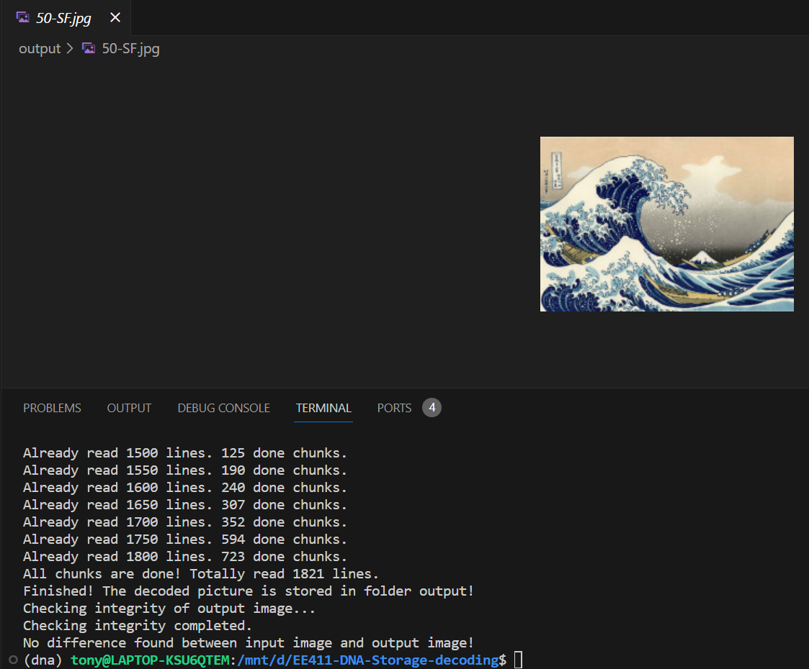

# EE411 Project Report

> 12011702 张镇涛
>
> 12012801 金扬

### Contribution

张镇涛(50%)：

overall system setup, translation, error recovery, documentation/report writing

金扬(50%)：

message passing, integrity check, project file structure optimization, I/O optimization, report inspection

#### Project Repository

https://github.com/TonyZhang14242/EE411-DNA-Storage-decoding


## Background

In this project, we are asked to implement a DNA storage decoding system, which are designated to decode a series of encoded DNA fragments, consisting of four different bases, namely "A","T","C","G", back into a binary computer file.

This kind of storage has many advantages over tranditional storage, and could be listed from many aspects:

The first is high storage density. As we know DNA has an extremely high data storage density. It is estimated that one gram of DNA can store approximately 215 PB of data. This is several orders of magnitude higher than traditional storage mediums such as hard drives. 

The next advantage is energy efficiency. DNA data storage does not require continuous power supply for data retention, unlike traditional storage methods, with which all data may be lost without electricity supply.

Also, the longevity of data storage makes it attractive for preservations of important data, especially data needed to be preserved in long-term.

This report will briefly introduce the methodology used to recover image and show the result of experiment.


## Methodology 

### Environment Setup

**Operating System:** Ubuntu 20.04

**Programming Language**: Python

**Version**: 2.8

**Dependencies**: reedsolo, numpy, etc.

Notice that in this project, we use python2 instead of python3, since in python3, the encoding result might be quite different from those in python2, which are stored in given DNA sequences.

Also we use reedsolo library, which is used to try to fix potential error in DNA sequences.


### Error Forms

Errors can occur in many ways. Ideally, no errors presents in DNA sequences we get. However, the PCR test used to confirm the base sequences of DNA has error rate.

Commonly, three forms of error presents in PCR: substition error, insertion error, deletion error.

The first error do not has impact on sequence length while the other twos have.


### Overall Process

The encoding and decoding process of DNA storage could be represented as a information channel. The channel $C$ does not guarantee integrity of data while transimiting.

We mark the origin file stored in computer (binary source code) as $X$. The DNA sequences after encoding process is $Y$, and the result of PCR test is $\hat Y$ and the decoding result as $\hat X$.

The chain of $X\to Y\to \hat Y\to \hat X$ could be approximately regarded as Markov chain.

In this project, the decoding process is $\hat Y\to \hat X$, which is exactly what we focus on.


### Translation

We need to first translate 'A', 'C', 'G', 'T' into decimal number '0','1','2','3'.

Then, we substitute these decimal numbers into binary, i.e. '00', '01', '10', '11'. This is the reversed step of DNA encoding process, where we translate binary '00', '01', '10', '11' into corresponding bases.

Also, for convenience of upcoming file recovery process, we store them as an array of integer (8 bits).

For example:

```python
GGCTGCCAAACGACGATGCGATCTTGGGTAGCGAAGACAGTACTCTGATGTCGACACCCGAGTTTAGAGCCTACTAGAGCTATGGTGAGACGAGGATTAG #DNA sequences
2213211000120120321203133222302120020102301313203231201011120233302021130130202130322320201202203302 #Decimal representation
10100111100101000000011000011000111001100011011111101010110010011000001000010010110001110111100011101101100001000101011000101111110010001001011100011100100010011100111010111000100001100010100011110010 #Binary representation
[167, 148, 6, 24, 230, 55, 234, 201, 130, 18, 199, 120, 237, 132, 86, 47, 200, 151, 28, 137, 206, 184, 134, 40, 242] #Convert to integer array
```


### Error Recovery

Just as what we mentioned before, different kinds of errors may contained in PCR test result. Code correction can be achieved with limitation using Reed Solomon code, which is stitched at the tail of each outer code.

Here we exclude the sequence with error, which is founded by RS code, meanwhile, attempt to correct code with substitution error.

All the above process are done by library `reedsolo`. When it can not execute error recovery, it'll throw an error for that code.

For correct code after error recovery, we divide it based on code structure (seed, 4 bytes; data, 16 bytes).

Thus we get the "droplet".


### Message Passing

First we generate a list of segment identifiers using the seed we get after partition. This process is a psuedo-random process. This is also a field for all droplets.

After we add "droplet" into "glass" and map for each chunk all connected droplets, we can start message passing process.

The process are concluded as follows, just the same as reference document:

1. If the droplet contains inferred segments, the algorithm will XOR these segments from the droplet and remove them from the identity list of droplet.

2. solving segments when the droplet have exactly 1 segment. If the droplet has only one segment left in the list, the algorithm will set the segment to the droplet's data payload.

3. Recursively propagate the new inferred segment to all previous droplets until no more updates are made.

For the first two steps, we can implement by just using dictionary in python. For third step, we need to define a function for whole message passing process, so that this function can be called recursively by program.

This is a example for third step, showing recursive process:

```python
def message_passing(self, droplet):
	#Step 1 and 2 omitted...
    for other_droplet in self.chunk_to_droplets[lone_chunk].copy():
        self.message_passing(other_droplet)
```


### Iterative Sequence Reading

Each time after message passing for a input sequence, we need to check whether the file is recovered or not. If not, we need to move on to the next one and repeat the above processes.

Once file is recovered or number of sequences read has exceeded the limit (indicating failure), terminate the iterative reading and dump all droplets in glass to generate the decoded file.


## Experiment

**The file structure of the project**:

```
Project
|
├─code
|   |-decoder.py
|   |-glass.py
|   |-main.py
|   
├─output
└─src
|  |-50-SF.txt
└─run.sh
```


**Result of decoded picture**:




**Integrity and correction check:**

We use library `pillow` to compare the pixels of original picture and the one we decoded.

```python
diff = ImageChops.difference(image_origin, image_out)
if diff.getbbox() is None:
    print('No difference found between input image and output image!')
```

The function will not get any value with `getbbox()` if no difference of two pictures in pixels are found.


## Reference

\- Erlich, Yaniv, Zielinski, et al. DNA Fountain enables a robust and efficient storage architecture.[J]. Science, 2017.

\- Erlich Y , Zielinski D . Capacity-approaching DNA storage. 2016.

\- M. Luby, “LT-codes,” in Proc. 43rd Annu. IEEE Symp. Foundations of Computer Science (FOCS), Vancouver, BC, Canada, Nov. 2002, pp. 271–280.

\- Mceliece R J . The theory of information and coding:a mathematical framework for communication[M]. Addison-Wesley Pub. Co. Advanced Book Program, 1977.